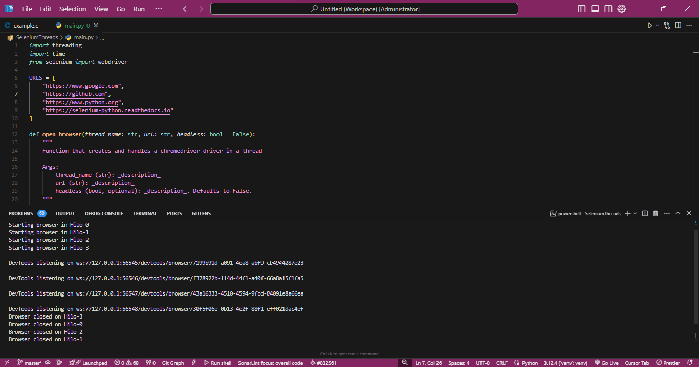
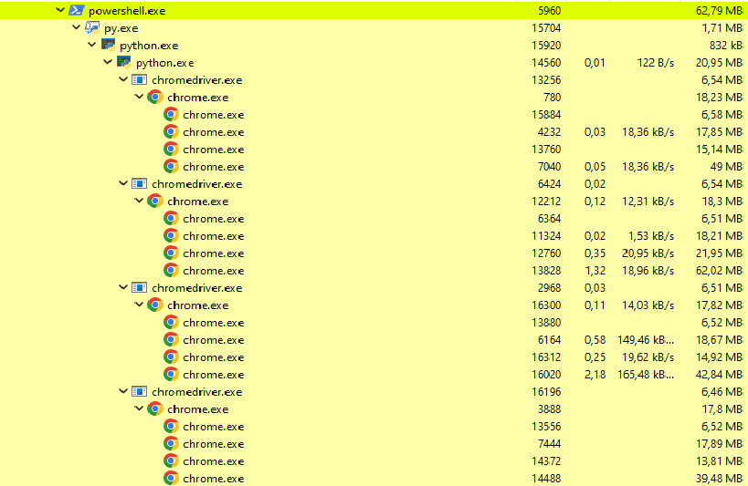

# Multi-threaded Browser Automation with Selenium

This project is designed to run instances of Selenium WebDriver in multiple threads using the `threading` library. Each thread opens a browser instance and navigates to a different URL.





The project is written in Python 3.12.4 and uses `selenium 4.25.0` to interact with web browsers. Additionally, it runs within a virtual environment (`venv`) to isolate the project dependencies from the system.

## System Requirements

- **Python**: 3.12.4
- **Selenium**: 4.25.0
- **ChromeDriver**: Compatible with the version of Chrome installed on your system

## Project Structure

```text
├── venv/                   # Virtual environment to isolate dependencies
├── requirements.txt         # File containing project dependencies
├── main.py                  # Main script to launch browsers in threads
└── README.md                # Project documentation
```

### Dependencies

The project dependencies are listed in the `requirements.txt` file. Be sure to install the dependencies by running:

```bash
pip install -r requirements.txt
```

### Setting up the Virtual Environment (venv)

Before starting, it's recommended to create and activate a virtual environment for your project:

```bash
# Create a virtual environment
python -m venv venv

# Activate the virtual environment
# On Windows
.\venv\Scripts\activate
# On Mac/Linux
source venv/bin/activate
```

### Installing Dependencies

To install all necessary dependencies, run the following command:

```bash
pip install -r requirements.txt
```

### Using the Project

The `main.py` script launches browsers in multiple threads to visit different websites simultaneously.

#### Code Structure:

1. **Library Imports**: The project uses `threading` to create multiple threads and `selenium` to control the web browser.
2. **URL Configuration**: The `URLS` array contains the list of URLs that will be visited.
3. **`open_browser` Function**: Each thread executes this function, which sets up the browser options and opens a `webdriver.Chrome` instance.
4. **Thread Management**: The code creates and manages several threads, where each thread opens a Chrome instance and navigates to the specified URL.

#### Running the Script:

You can run the script with:

```bash
python main.py
```

This command will open four Chrome browser instances (simultaneously, if your system allows it) and navigate to the URLs specified in the `URLS` list.

```python
URLS = [
    "https://www.google.com",
    "https://github.com",
    "https://www.python.org",
    "https://selenium-python.readthedocs.io"
]
```

#### Browser Configuration Customization

The `open_browser` function allows an option to run the browser in `headless` mode (without a graphical interface) or with a visible interface. You can change this behavior by passing `True` or `False` as arguments to the function.

```python
def open_browser(thread_name: str, url: str, headless: bool = False):
    """
    Function that creates and handles a chromedriver driver in a thread
    
    Args:
        thread_name (str): _description_
        url (str): _description_
        headless (bool, optional): _description_. Defaults to False.
    """
```

### Example Output

```text
Starting browser in Hilo-0
Starting browser in Hilo-1
Starting browser in Hilo-2
Starting browser in Hilo-3
Browser closed on Hilo-0
Browser closed on Hilo-1
Browser closed on Hilo-2
Browser closed on Hilo-3
All browsers have ended.
```

### Error Handling

The code handles common errors that may arise, such as timeouts. If the browser doesn't load a page within the specified time, the program will continue executing and close the browser instance after 5 seconds.

```python
driver.set_page_load_timeout(15)  # Set a timeout of 15 seconds for page load
```

### License

This project is licensed under the MIT License. You can use, modify, and distribute this software under the terms of the license.